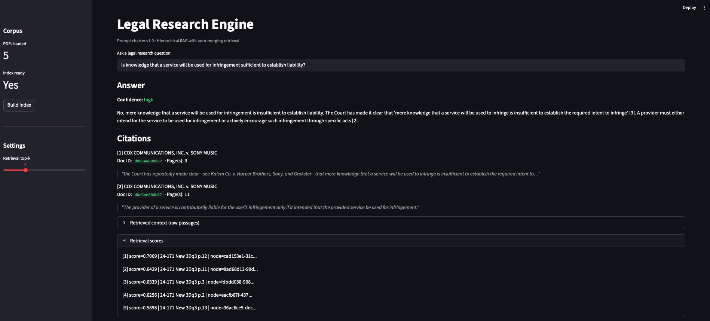
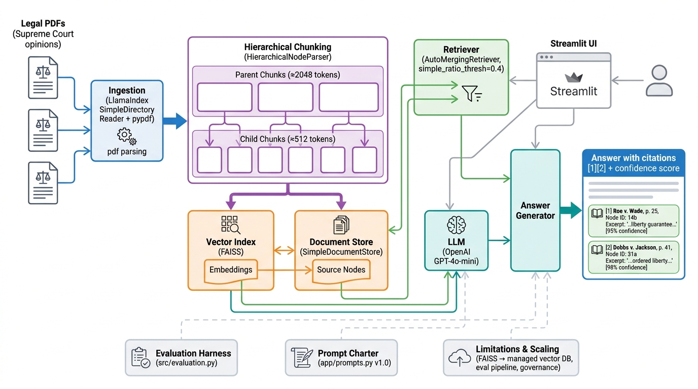

# Legal Engine

A RAG-powered legal research prototype that ingests legal PDFs, builds a hierarchical chunk index, and answers questions with grounded, cited answers via a Streamlit UI.



## Architecture



**Key components:**
- **Ingestion** — Legal PDFs (U.S. Supreme Court opinions) are parsed via LlamaIndex `SimpleDirectoryReader` with `pypdf`, preserving page numbers and source metadata.
- **Hierarchical Chunking** — `HierarchicalNodeParser` splits documents into a two-level tree: parent chunks (~2048 tokens) and child chunks (~512 tokens). Parent chunks capture full sections; child chunks enable precise retrieval.
- **Vector Index (FAISS)** — Child chunks are embedded and stored in a FAISS index for vector similarity search. Embeddings are generated via OpenAI.
- **Document Store (`SimpleDocumentStore`)** — All source nodes (both parent and child) are persisted so the retriever can look up parent context on demand.
- **Retriever (`AutoMergingRetriever`)** — Queries hit the FAISS index to find relevant child chunks. When enough siblings from the same parent match (`simple_ratio_thresh=0.4`), the retriever merges them into the parent chunk for broader context.
- **LLM (OpenAI GPT-4o-mini)** — The retrieved context is sent to the LLM along with a structured prompt charter (`app/prompts.py` v1.0) that enforces grounded answers, inline citations, confidence scoring, and explicit abstention when evidence is insufficient.
- **Answer Generator** — Produces a JSON response with `answer_text`, bracketed citations (`[1]`, `[2]`), and a confidence level. Each citation carries the document title, document ID, page number, node ID, and a supporting excerpt.
- **Streamlit UI** — The frontend provides corpus management, question input, answer display with inline citations, and a retrieval context inspector for verifying grounding.
- **Evaluation Harness** (`src/evaluation.py`) — Runs hand-crafted test cases covering answerable questions (checking citations and keywords) and unanswerable questions (checking that the system declines with `insufficient` confidence).
- **Prompt Charter** (`app/prompts.py` v1.0) — Centralized, versioned prompt definitions that enforce grounding rules, citation format, confidence levels, failure modes, and a legal disclaimer.

## Setup

**macOS / Linux:**
```bash
python -m venv .venv
source .venv/bin/activate
pip install -r requirements.txt

cp .env.example .env
# Edit .env with your OpenAI API key
```

**Windows:**
```powershell
python -m venv .venv
.venv\Scripts\activate
pip install -r requirements.txt

copy .env.example .env
# Edit .env with your OpenAI API key
```

## Usage

```bash
# Launch the UI
streamlit run app/ui.py
```

From the sidebar:
1. Place PDFs in `data/raw/` (see [Corpus](#corpus) below)
2. Click **Build index** to parse, chunk, and index
3. Ask questions in the main panel

**Sample questions:**
1. What is required to establish contributory copyright liability according to the Court?
2. Is knowledge that a service will be used for infringement sufficient to establish liability?
3. What are the four factors considered in a fair use analysis?

## Corpus

The corpus consists of 5 recent U.S. Supreme Court slip opinions randomly selected from the [2025 Term opinions page](https://www.supremecourt.gov/opinions/slipopinion/25):

| Case | PDF |
|------|-----|
| No. 24-813 | [24-813_3e04.pdf](https://www.supremecourt.gov/opinions/25pdf/24-813_3e04.pdf) |
| No. 24-539 | [24-539new_hfci.pdf](https://www.supremecourt.gov/opinions/25pdf/24-539new_hfci.pdf) |
| No. 24-1056 | [24-1056_qn12.pdf](https://www.supremecourt.gov/opinions/25pdf/24-1056_qn12.pdf) |
| No. 24-171 | [24-171_new_3dq3.pdf](https://www.supremecourt.gov/opinions/25pdf/24-171_new_3dq3.pdf) |
| No. 25-297 | [25-297_bqm2.pdf](https://www.supremecourt.gov/opinions/25pdf/25-297_bqm2.pdf) |

These are public-domain documents. Place them in `data/raw/` before building the index.

### Running evaluation

```bash
python -m src.evaluation
```

## Chunking Strategy

**Hierarchical (parent/child)**:
- Parent chunks: 2048 tokens — large enough to contain full statutory sections
- Child chunks: 512 tokens — precise enough for targeted retrieval
- LlamaIndex `HierarchicalNodeParser` creates the two-level tree and links children to parents

**Why hierarchical?** Legal questions often need both precision (which specific clause?) and context (what does the surrounding section say?). Child chunks provide precision at retrieval time; `AutoMergingRetriever` expands to parent chunks when multiple children from the same section are relevant.

## Retrieval Approach

**AutoMergingRetriever** with `simple_ratio_thresh=0.4`:
- Vector similarity search runs on leaf (child) chunks
- If ≥40% of a parent's children appear in results, the parent replaces them
- This provides broader context without losing retrieval signal

**Why not hybrid (vector + BM25)?** For this prototype scope, LlamaIndex's auto-merging retriever already handles the precision vs. recall tradeoff. In production, I'd add BM25 for exact statutory reference matching (e.g., "Section 107") and use reciprocal rank fusion.

## Citation Strategy

- The prompt charter requires inline bracketed citations `[1]`, `[2]` referencing retrieved excerpts
- Each citation carries: document title, document ID, page number(s), node ID, and a supporting excerpt
- The system declines to answer (confidence: `insufficient`) when evidence is weak

## Evaluation

The evaluation harness (`src/evaluation.py`) tests:
- **Answerable questions**: checks citations exist, expected keywords appear, confidence is correct
- **Unanswerable questions**: checks the system declines with `insufficient` confidence
- Composite score per test case, averaged across the suite

5 hand-crafted test cases covering copyright fair use, civil rights statutes, exclusive rights, and an out-of-scope question.

## Prompt Charter

All prompts live in `app/prompts.py` (versioned, v1.0). The charter defines:
- **System prompt**: grounding rules, citation format, confidence levels, failure modes, legal disclaimer
- **User template**: structured question + numbered context excerpts
- **Output contract**: JSON schema with `answer_text`, `citations[]`, and `confidence`

## Limitations

- **PDF only**: no DOCX, HTML, or other formats
- **No multi-tenant isolation**: single-user local prototype
- **General-purpose embeddings**: `text-embedding-3-small` is not legal-domain fine-tuned
- **No re-ranking**: results come directly from vector similarity
- **No caching**: every query re-runs embeddings and LLM calls
- **Small eval set**: 5 test cases — production needs hundreds with expert annotation

## Production Scaling

| Concern | Prototype | Production |
|---------|-----------|------------|
| Vector store | FAISS (local) | Managed service (Pinecone, Qdrant) with tenant isolation |
| Embeddings | OpenAI text-embedding-3-small | Legal-domain fine-tuned model |
| Chunking | Two-level hierarchy | Document-type-specific parsers |
| Retrieval | Auto-merging only | Hybrid (vector + BM25 + re-ranker) |
| Evaluation | 5 manual test cases | LLM-as-judge + human review pipeline |
| Observability | None | Trace logging, latency metrics, cost tracking |
| Governance | Single prompt file | Versioned prompts with A/B testing and audit trail |
| Auth | None | Tenant-scoped document ACLs |
